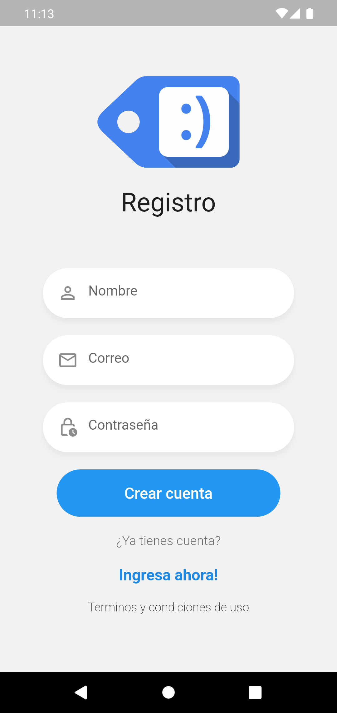
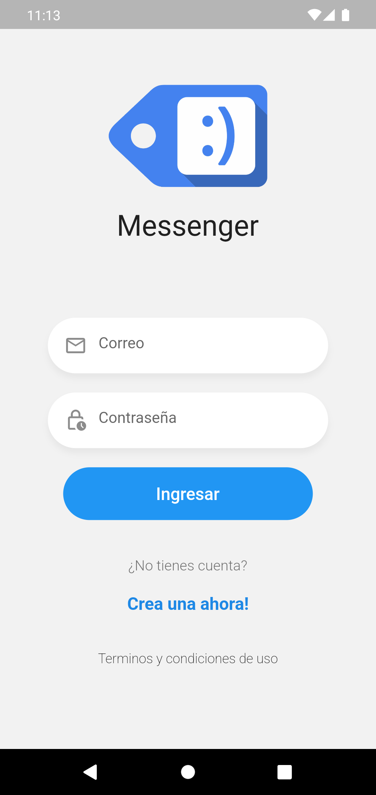
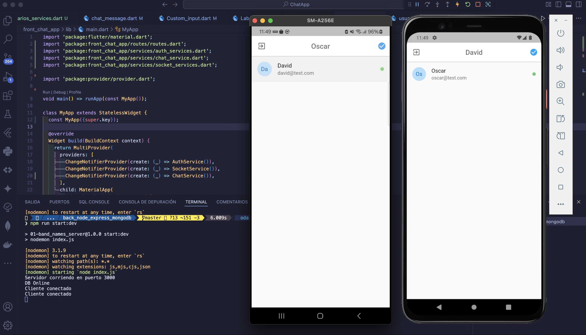
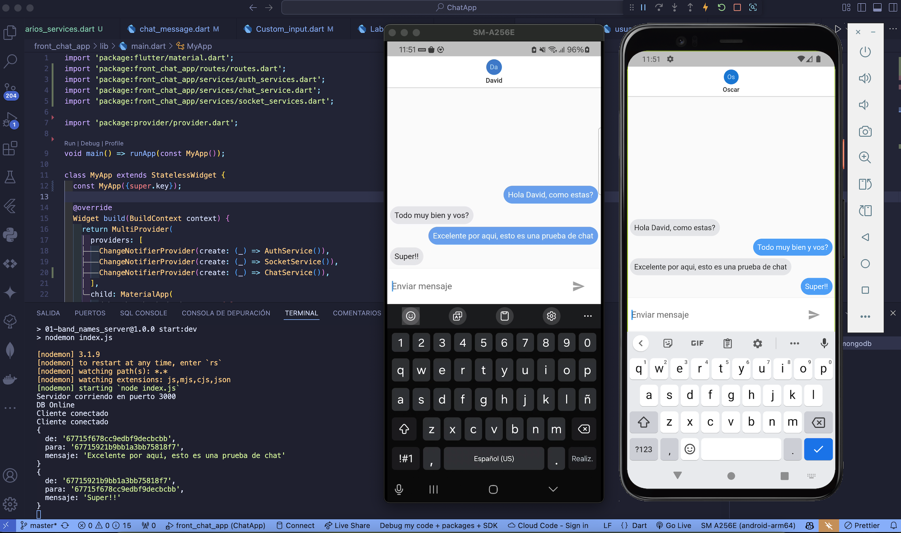
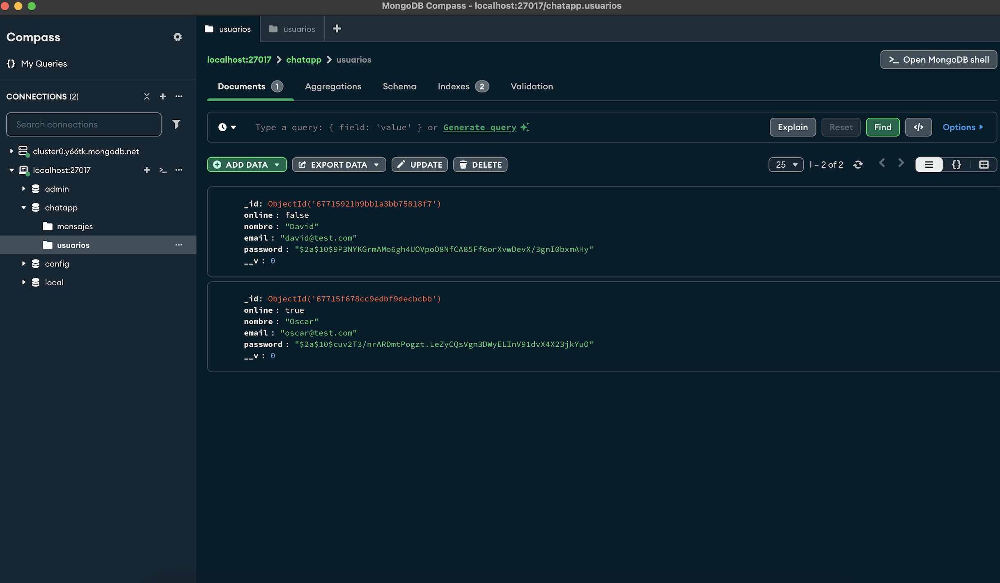
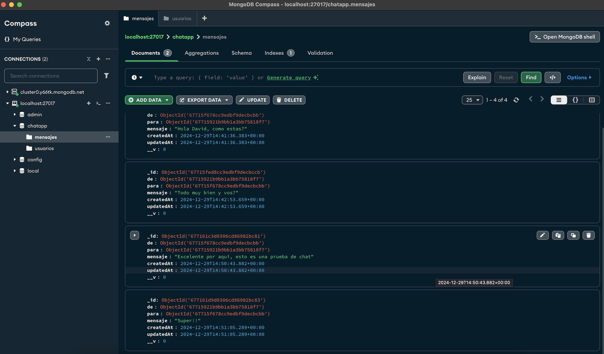

# ChatApp - Full Stack Application (Flutter & Node.js)

ChatApp es una aplicación Full Stack desarrollada con Flutter en el frontend y Node.js en el backend, utilizando MongoDB como base de datos. La aplicación permite a los usuarios registrarse, iniciar sesión y enviar mensajes en tiempo real entre usuarios. Es una solución ideal para construir un sistema de mensajería moderno y escalable.

## Imagenes del funcionamiento

### Registro e Inicio de Sesión

<p align="center">
  
  
</p>

### Usuarios online

<p align="center">
  
  
</p>

### Registro en MongoDB

<p align="center">
  
  
</p>

## Funcionalidades

### Frontend (Flutter)

- Registro de nuevos usuarios.
- Inicio de sesión seguro utilizando tokens JWT.
- Lista de contactos y mensajes.
- Mensajería en tiempo real utilizando Socket.IO.
- Actualización automática de conversaciones.
- Almacenamiento seguro de tokens en el dispositivo utilizando `flutter_secure_storage`.

### Backend (Node.js)

- Autenticación segura con JWT (JSON Web Tokens).
- Cifrado de contraseñas con `bcryptjs`.
- API RESTful para manejar usuarios, mensajes y autenticación.
- Comunicación en tiempo real con Socket.IO.
- Conexión a la base de datos MongoDB utilizando Mongoose.

## Tecnologías Utilizadas

### Frontend

- **Flutter**: Framework para construir interfaces multiplataforma.
- **Provider**: Gestión de estado.
- **Socket.IO Client**: Comunicación en tiempo real.
- **Flutter Secure Storage**: Almacenamiento seguro de datos sensibles.
- **HTTP**: Gestión de solicitudes HTTP.

### Backend

- **Node.js**: Entorno de ejecución de JavaScript.
- **Express**: Framework para construir APIs RESTful.
- **Socket.IO**: Manejo de WebSockets para comunicación en tiempo real.
- **MongoDB**: Base de datos NoSQL.
- **Mongoose**: Modelado de datos para MongoDB.
- **bcryptjs**: Cifrado de contraseñas.
- **JWT**: Manejo de autenticación segura.
- **dotenv**: Gestión de variables de entorno.

## Requisitos Previos

1. **Flutter SDK** instalado (se recomienda usar FVM para manejar versiones de Flutter).
2. **Node.js** instalado (se recomienda usar NVM para manejar versiones de Node.js).
3. **MongoDB** configurado y en ejecución (puede ser local o en un servicio como MongoDB Atlas).
4. **Git** instalado para clonar el repositorio.

## Instalación

### 1. Clonar el Repositorio

Clona el repositorio en tu máquina local:

```bash
git clone https://github.com/OdaFra/ChatApp.git
cd ChatApp
```

### 2. Configurar el Backend

Navega al directorio del backend y configura el servidor:

```bash
cd back_node_express_mongodb
```

#### 2.1 Usar NVM para Manejar la Versión de Node.js

Si no tienes NVM instalado, sigue las [instrucciones de instalación de NVM](https://github.com/nvm-sh/nvm#installing-and-updating).

Instala la versión de Node.js utilizada en el proyecto (entre 14.x, 16.x y hasta 18.x):

```bash
nvm install 18
nvm use 18
```

#### 2.2 Instalar Dependencias

Instala las dependencias necesarias:

```bash
npm install
```

#### 2.3 Configurar Variables de Entorno

Crea un archivo `.env` en el directorio `backend` con el siguiente contenido:

```env
PORT=3000
DB_CNN=mongodb+srv://<usuario>:<password>@cluster.mongodb.net/chatapp
JWT_SECRET=tu_jwt_secreto
```

Asegúrate de reemplazar `<usuario>`, `<password>` y `cluster.mongodb.net/chatapp` con las credenciales y la URL de tu base de datos MongoDB.

#### 2.4 Iniciar el Servidor

Inicia el servidor en modo desarrollo:

```bash
npm run start:dev
```

El servidor estará disponible en `http://localhost:3000`.

### 3. Configurar el Frontend

Navega al directorio del frontend:

```bash
cd ../front_chat_app
```

#### 3.1 Usar FVM para Manejar la Versión de Flutter

Si no tienes FVM instalado, instálalo ejecutando:

```bash
dart pub global activate fvm
```

Instala la versión de Flutter especificada en el proyecto:

```bash
fvm install 3.0.0
fvm use 3.0.0
```

#### 3.2 Obtener las Dependencias de Flutter

Ejecuta el siguiente comando para descargar las dependencias:

```bash
fvm flutter pub get
```

#### 3.3 Ejecutar la Aplicación Flutter

Ejecuta el proyecto en un emulador o dispositivo físico:

```bash
fvm flutter run
```

## Estructura del Proyecto

### Frontend (Flutter)

El directorio del frontend incluye los siguientes archivos importantes:

- `lib/main.dart`: Punto de entrada de la aplicación.
- `lib/models/`: Modelos de datos como usuarios y mensajes.
- `lib/services/`:Gestión del estado con Provider como la lógica de comunicación con el backend (HTTP y WebSockets).
- `lib/widgets/`: Componentes reutilizables de la interfaz de usuario.
- `lib/routers/`: Gestión de rutas.
- `lib/helpers/`: Componentes reutilizables de la interfaz de usuario.
- `lib/global/environment`: Ip agregada de forma estática del host anfitrión (Corresponde a la ip del servicio backend ejecutado).

### Backend (Node.js)

El directorio del backend incluye los siguientes archivos importantes:

- `index.js`: Punto de entrada del servidor.
- `models/`: Definición de esquemas de MongoDB para usuarios y mensajes.
- `database/`: Lógica para manejar la conexión a la base de datos.
- `routes/`: Definición de rutas de la API.
- `controllers/`: Lógica para manejar las solicitudes HTTP.
- `middlewares/`: Validaciones y autenticaciones de rutas.
- `sockets/`: Lógica de manejo de eventos de Socket.IO.

## Uso

1. **Inicia el servidor**: Asegúrate de que el backend esté en ejecución antes de iniciar la aplicación Flutter.
2. **Ejecuta el frontend**: Abre un emulador o conecta un dispositivo físico y ejecuta el comando `fvm flutter run`.
3. **Crea una cuenta**: Regístrate como un nuevo usuario en la aplicación.
4. **Inicia sesión**: Ingresa con tus credenciales para acceder al chat.
5. **Envía mensajes**: Selecciona un contacto y comienza a enviar mensajes en tiempo real.

## Consideraciones

- Asegúrate de que MongoDB esté en ejecución y accesible desde el backend.
- Verifica que las versiones de Node.js y Flutter sean compatibles con las especificadas en el proyecto.
- Si encuentras problemas con las dependencias, elimina los archivos `node_modules` o `pubspec.lock` y vuelve a instalarlas.

## Contáctame

No dudes en comunicarte conmigo si tienes alguna pregunta, comentario u oportunidad de colaboración:

- **Correo electrónico**: [osramirezf@gmail.com]
- **LinkedIn**: [[Perfil de LinkedIn](https://www.linkedin.com/in/oscar-ramirez-franco/)]
- **GitHub**: [[Perfil de GitHub](https://github.com/OdaFra)]
